# Seablock Starter Guide

> This guide is adapted from u/DanielKotes' original Reddit post, reorganized by science stage for clarity. For the original, see [Reddit](https://www.reddit.com/r/Seablock/comments/qkxcs3/seablock_starterguide/?utm_source=share&utm_medium=web2x&context=3).

## Introduction

Welcome to Seablock! This modpack transforms Factorio into a unique challenge: you start on a single block of land, with no ore patches and limited space. Nearly everything comes from water, including ores. Expect 10x the items, recipes, and buildings compared to vanilla Factorio. Biters are rare—only worms appear, making the game more peaceful and focused on factory expansion.

This guide is based on u/DanielKotes' work, sorted by science stages instead of production category. Some content is directly referenced from the original guide and Foreman charts. For installation help, see [Guides:Installation](/getting-started/installation.md).

> **Tip:** Play the vanilla tutorial before starting Seablock.

### Terminology

- **Building Tier:** T0 is burner tier; T1/T2/etc. match the building's name (e.g., burner ore crusher is T0, ore crusher 1 is T1).
- **Circuits & Science:** Circuits are referred to by color (e.g., brown circuit for basic circuit). Science packs are also color-coded, with some special types (e.g., plant science, weapon science).
- **Recipe Tier:** Uses Roman numerals as shown in recipe icons (e.g., dirt water electrolysis I is TI, fast water electrolysis II is TII).
- **Belts & Inserters:** Referred to by color, from lowest to highest: white → yellow → red → blue → purple → green.

---

## First Step (Pre Red-Science)

You begin on a small island, with your ship transformed into a resource-rich rock to kickstart your factory. Progress is challenging, but possible. The factory won't build itself unless you add extra mods for automation.

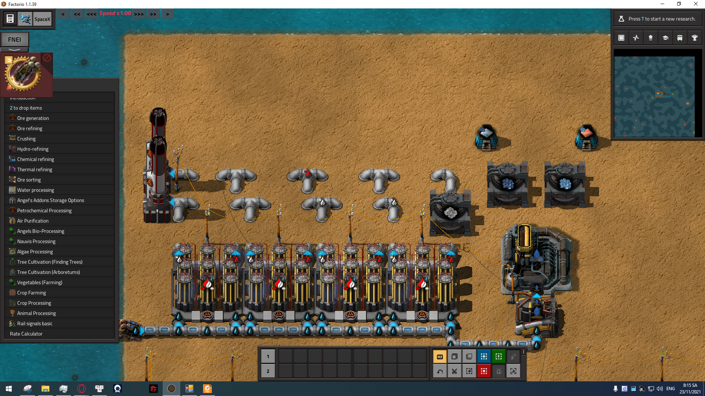
_Ideal starter ore sorting factory, spaced for future inserters and belts._

### Pre-Red Science Goals

1. Crushed stiratite
2. Farm brown algae
3. Craft brown circuit
4. Craft 1 lab

#### Step-by-Step

- **Step 0:** If you are not at green science and aren't hand-crafting something important (such as buildings), queue up a few hundred cellulose fiber forage crafts. These are your fuel, and until you get stable power generation, you are the fuel provider for your factory. AFK crafting 1k is optional.
- **Step 1:** Turn on alt mode (press alt) for visibility. Grab resources from the rock, expand the island with landfill (horizontal recommended), place all windmills, and forage cellulose fiber for fuel and crafting. Windmills provide free power—don't remove them.
- **Step 2:** Build and set up: T1 crystallizer, 2 flare stacks, 4 T1 electrolysers, 3 T0 ore crushers, offshore pump, T1 liquefier, 2 filtering furnaces. Use TI water electrolysis, connect hydrogen and oxygen outputs to flare stacks, process slags to crushed stone, then to mineralized water, then crystallizer for pre-ores. Smelt stiratite and saphirite for copper and iron plates. Collect slags, crush to stone, liquefy to mineralized water, crystallize to pre-ores, crush and smelt for plates. Don't forget to clear byproducts from crushers.
- **Step 3:** Unlock and build an algae farm for green algae. Pipe water to the farm, set Green algae I, and complete step 2 of the tutorial tree.
- **Step 4:** Use brown algae, copper plates, and cellulose fiber to craft basic circuits. Stone pipes are recommended early unless you have excess copper.
- **Step 5:** Craft a lab to begin red science. All materials are available from the starting rock.

> **Note:** Use stone pipes during early phases unless you have excess copper. Copper pipes are unlocked after step 3.

---

## Start of Automation (Red Science Stage)

When you finish step 3, you unlock logistics: yellow inserters, belts, iron/copper pipes. Burner inserters are also unlocked, but are rarely used. Challenge yourself by using only burner inserters for a rocket launch if you want. Unlock boiler and steam engine for power.

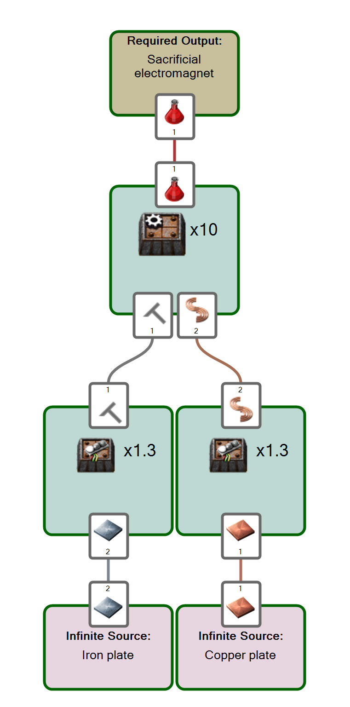
_Basic red science setup._

### Red Science Production, Basics, Research, and Goals

Red science is simple: three assembling machines (or 1 player), some iron and copper plates, and you're done. Your goal is to get proper power, upgrade ore production, and reach green science. You can ignore belts for now; early hours involve a lot of hand-feeding (optional: get even distribution mod).

Main technology tree order:

1. Automation (electrical ore crushers, assembling machines)
2. Wood processing 2 (fuel bonuses)
3. Green algae processing (**Milestone!**)
4. Washing, basic chemistry, sulfur processing (first sulfur)
5. Fluid control, water treatment, slag processing (**Milestone!**)
6. Steel, mechanical refining, coal processing, solder casting, electronics, logistics, inserter upgrades, green science (**Milestone!**)

> **HINT:** Once you have warehouses or silos researched, you can set up compact direct-insertion chains. Drop base metals into the silo, assemblers around it pick what they need, craft intermediates, and pass them on, with the final product dropped back in the silo. This leads to a compact, beltless design for the first few hours.

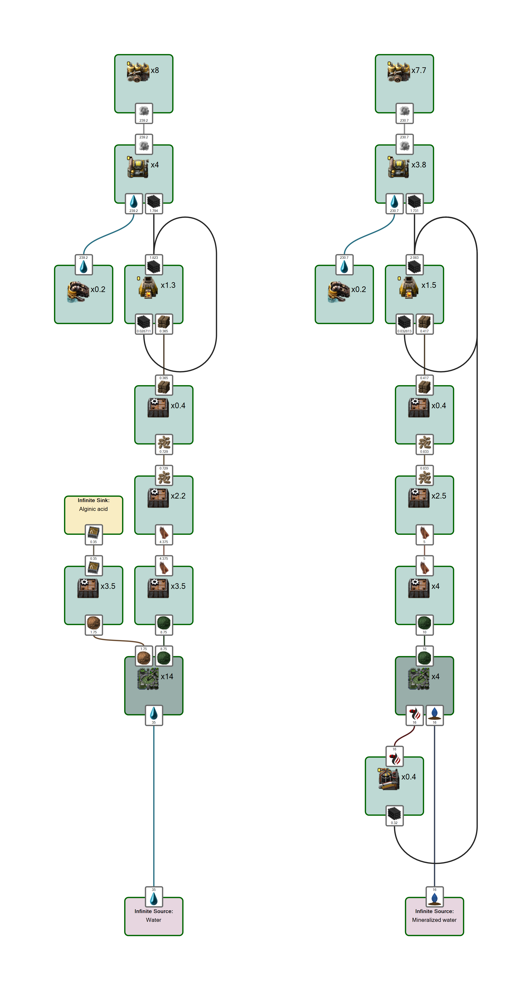

---

### Power Generation for Red

In the beginning, your only power options are windmills and foraging for cellulose fiber. Place all windmills and always forage cellulose fiber. Your first assembler machines can refine fiber into wood pellets, which can be burned to charcoal as soon as you research wood processing 2. Only burn cellulose in buildings at the start, before you have crafting machines for pellets.

Green algae is your first automated fuel source. You have two options:

1. Tier 1 green algae (with brown algae byproducts)
2. Tier 2 green algae (without brown algae byproducts, but with mineralized water requirement)

Both require similar power, but T2 needs more electrolysers for crushed stone. Once you reach green science and basic chemistry 2, T2 becomes the winner. T2 green algae requires ~3x fewer algae plants, saving landfill and time. Aim for 4-6 T2 algae plants for power generation (requires 4-6 boilers & 8-12 steam engines, enough for 12-16 electrolysers).

> **NOTE:** Store and transport fuel in wooden blocks, burning them to charcoal on site. 1 wooden brick makes 5 charcoal, so you need 5x less space and belt speed for the same fuel power.

---

### Ore Generation for Red

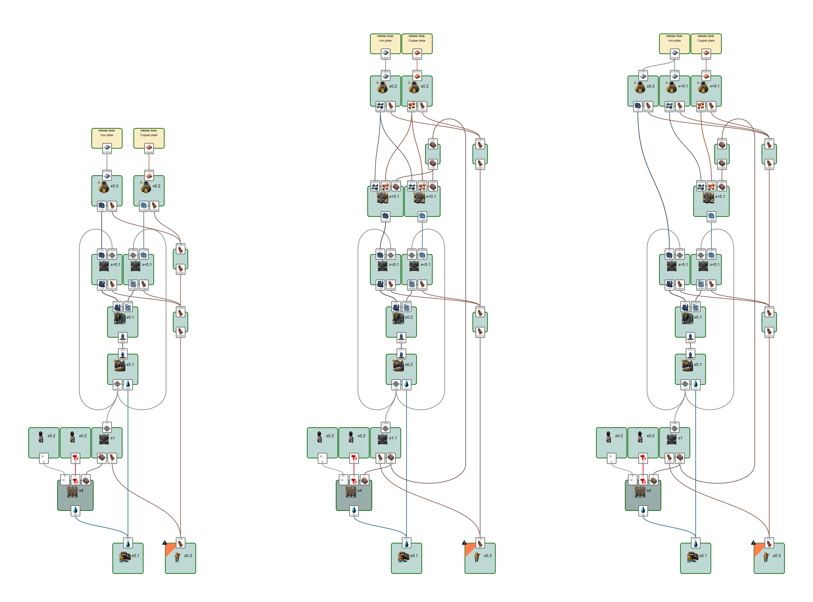

Your first ore generation methods are inefficient; upgrade as soon as possible. Don't build a large facility until green science. Don't go mega-scale until late-game unless you know what you're doing.

First ore generation is through mineralized water. Most metal production should go toward research. Direct smelting of stiratite and saphirite is best; sorting produces fewer plates. Only sort stiratite for a bit more iron if needed. Upgrade to electrical crushers quickly.

> **NOTE:** 30% of early hand-crafting time is spent making cellulose fiber for fuel. Switch to electrical crushers as soon as possible.

---

### Landfill Options for Red

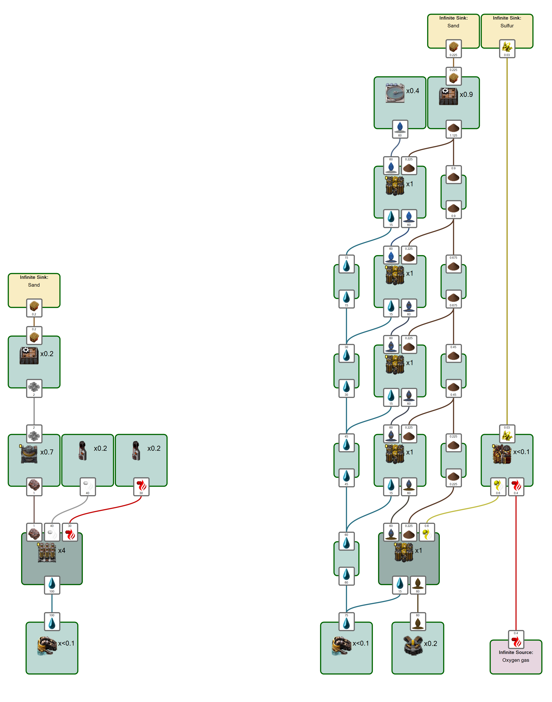

To expand your island, divert some slag from ores to landfill production. 0.2 landfill/sec from 4 electrolysers is enough for 0.12 metal plates (mineralized water) or 0.24 plates (slag slurry). 1k landfill = 270-530 red science packs worth of research. Expand only after stabilizing your base and unlocking alternate landfill options (green science).

Washing is available early and is more energy-efficient (1/3 power of electrolyser). Set up lines of 5 plants with a clarifier every 2 lines and a dedicated landfill assembler per line. Get at least 4 lines running and leave them on. Landfill is needed for a long time. Geodes and other options are covered in green science.

---

## Original Guide (Reddit Version)

> The following is a paraphrased version of the original guide, reorganized for clarity.

### Preface

- Seablock is a Bob & Angel modpack with no ore patches and limited land.
- Tiers refer to recipe tiers, not building tiers.
- No blueprints/screenshots—focus on tech tree flow and recipe charts.
- Images are downscaled for readability; original graphs available on [Foreman 2.0](https://github.com/DanielKote/Foreman2).

---

### First Steps

Managing to crash-land on a single block of land takes skill. Dive for wreckage, recover materials, and deposit them on a rock. Place land, attach windmills, and ask yourself: what now?

**Step 0:** If not at green science and not hand-crafting something important, queue up hundreds of cellulose fiber forage crafts. These are your fuel until you automate power. AFK crafting 1k is optional.

Place all windmills for free power. Don't remove them until you have automated charcoal power.

**Follow the science tutorial:**

1. Build 1 electrolyser, 2 flare stacks, 1 water pump, 1 ore crusher, 1 liquefier, 1 crystallizer. Set electrolyser to dirty water electrolysis, connect flare stacks, pump water, and get power. Watch your first slag be produced.
2. You have enough materials for 4 electrolysers; add 3 more for speed. Connect outputs for shared flare stacks.
3. Slag → crushed stone → mineralized water → pre-ores → smelt for plates.
4. Build an algae farm, connect water, set T1 green algae, and complete research.
5. Craft T1 (brown) circuits: iron and copper from crushed saphirite and stiratite, copper coils, wooden boards from brown algae → alginic acid → cellulose pulp (+cellulose fiber) → paper → boards.
6. Build your first lab (iron + copper + T1 circuits).

**Red science goals:**

1. Get some ores.
2. Get some science.
3. Make a rocket (focus on first two for now).

---

### Ore Generation

Direct smelting is best early; avoid sorting unless needed for iron. Upgrade to electrical crushers ASAP. Stone pipes are more efficient than copper pipes (5x cheaper based on slag used).

---

### Advanced Ore Generation

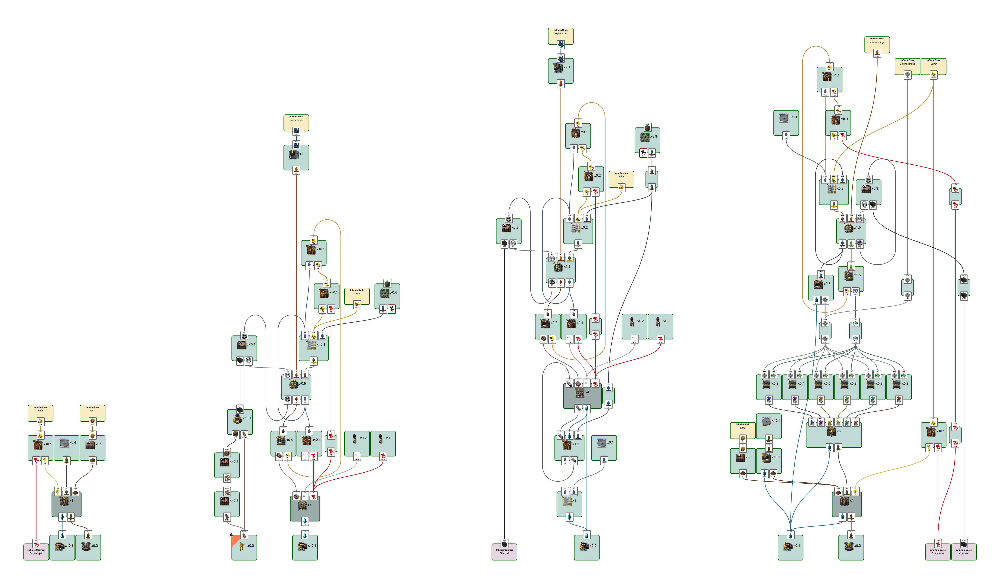

Start by getting sulfur via washing. Switch from mineralized water to mineral sludge for double ore output. T2 mineral sludge doubles output again. Geodes become available in green science and are preferred for mineral sludge. Direct ore sorting is optimal for base metals; catalysts needed for advanced sorting. Chunks and flotation cells are required for higher-tier metals.

> **Key note:** Initial power depends on mineralized water, which is a bottleneck in red science. Green science unlocks excess mineralized sludge and easier power.

**Geodes:** Once in green science, geodes are preferred for mineral sludge. Set up crystal sludge for later ore production. Use long inserters and warehouses for efficient geode processing.

**Direct ore sorting:** Best option for metallic ore production after early game. Minor waste for catalysts is negligible. Mineral catalysts for base metals; crystal catalysts for aluminum and higher. Purified water needed for crystal slurry.

**Chunks (washing):** Higher-tier metals require flotation cells, producing geodes and waste water. Filter waste water and recycle geodes.

---

### Science Progression

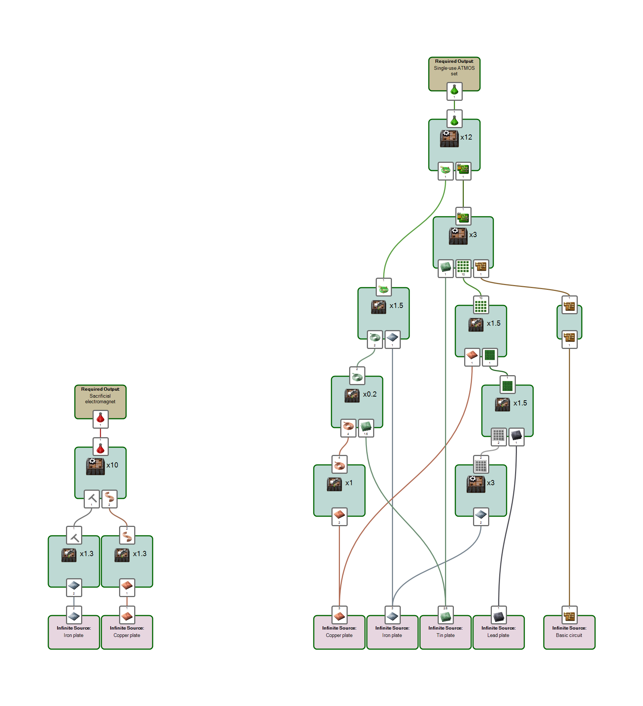

Red science: simple setup, focus on power and ore upgrades. Green science: requires all 4 base metals and T1 circuits. Mechanical refining unlocks metal plates. Warehouses/silos enable compact production chains.

Technology order:

1. Automation
2. Wood processing 2
3. Green algae processing (**Milestone!**)
4. Washing, basic chemistry, sulfur processing
5. Fluid control, water treatment, slag processing (**Milestone!**)
6. Steel, mechanical refining, coal processing, solder casting, electronics, logistics, inserter upgrades, green science (**Milestone!**)
7. Basic chemistry 2 (fast dirty water electrolysis = 2x slag, enough mineralized water for T2 green algae)
8. After this: aim for geodes, metallurgy, or expand to 20 electrolysers.

> **HINT:** Warehouses/silos allow compact direct-insertion chains for early production.

---

### Power Generation (Charcoal Processing)

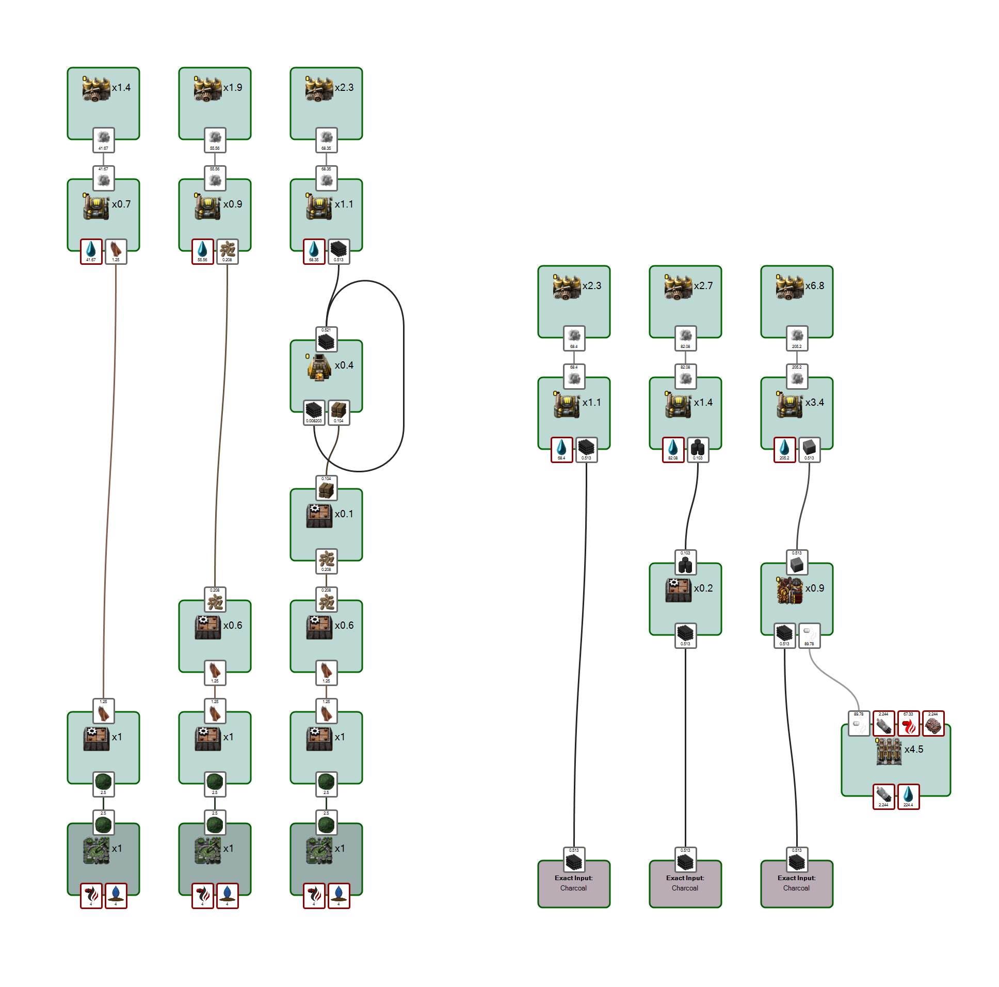

Cellulose fiber → wood pellets → charcoal → charcoal pellets → solid fuel. Higher-tier boilers/engines reduce footprint but not fuel consumption.

**Power from 1 T2 green algae farm:**

1. Cellulose fiber: 1.26MW
2. Wooden pellets: 1.71MW
3. Charcoal: 2.07MW
4. Charcoal pellets: 2.43MW
5. Solid fuel with hydrogen: 6.12MW (requires 4.5 electrolysis T2 per algae farm)

> **NOTE:** Higher-tier boilers/engines use less space, but same fuel.

---

### Landfill Options

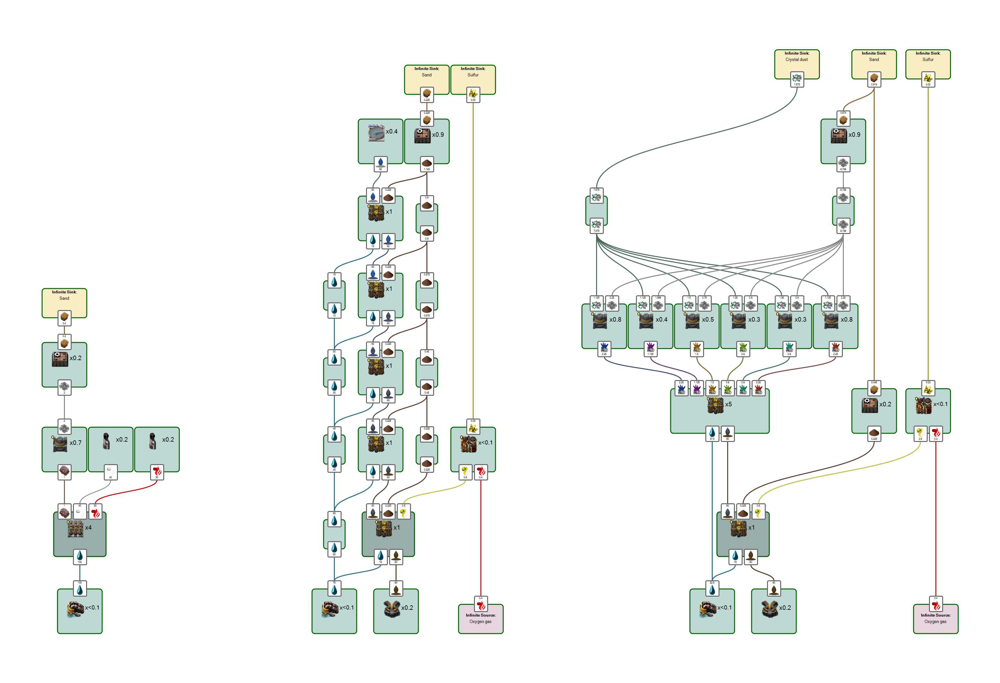

Early landfill from slag; washing is more efficient. Geodes allow mass landfill production later. Set up lines of washing plants and landfill assemblers. Stockpile crystal dust from geodes and landfill all crushed stone.

---

### Circuits

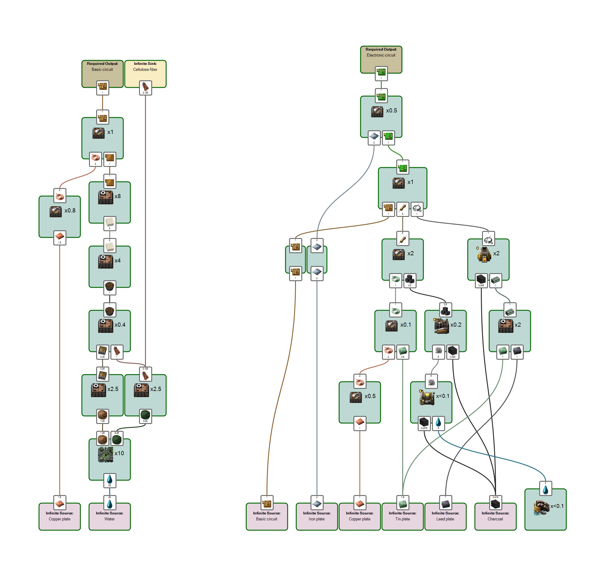

T1 circuits: simple, required before red science. T2 circuits: require all base metals and T1 circuits; build temporary factories until metallurgy is unlocked. Once you can grow wood, switch from algae/paper to wood boards. T2 circuits need all base metals and T1 circuits; main sink is new buildings.

> **NOTE:** Build temporary T1/T2 circuit factories, then replace with long-term options after metallurgy.

---

### Metallurgy

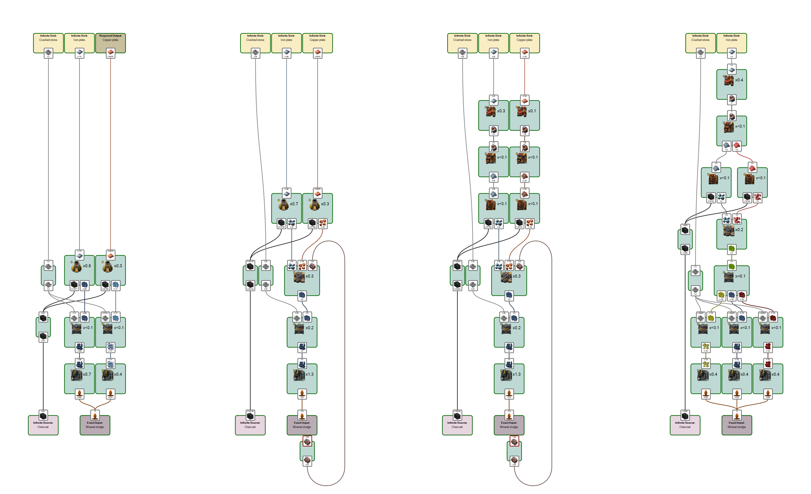
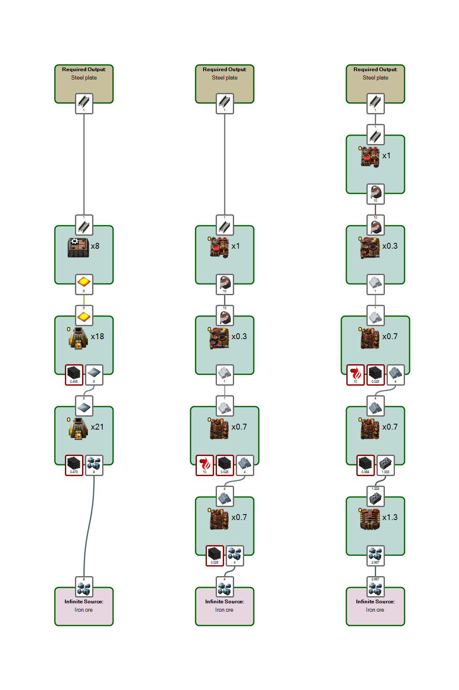
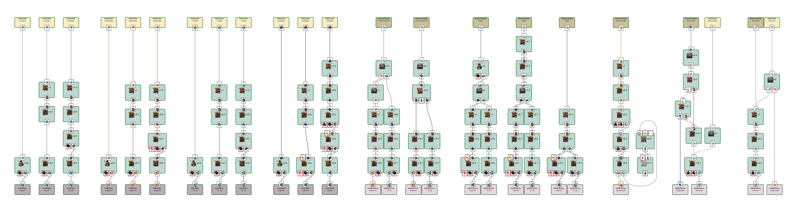

T1/T2 metallurgy boosts plate output and efficiency. Iron, copper, tin, lead, tinned wire, solder, aluminum, silicon, silver—all have unique metallurgy chains. Use coils and productivity modules for further efficiency. Manage coal/carbon for blast furnaces; avoid mixing fuel types.

**Red science metallurgy:**

1. Continue direct smelting (loses efficiency over time).
2. Begin sorting (single sorter for low throughput).
3. Research metallurgy T1 and start molten path (40% more plates, compact setup).
4. Use ferrous mixing for full iron output (manual balancing early on).

**Steel:** Avoid making steel during red science; it's very inefficient. Green science unlocks better options.

**Green science metallurgy:** T2 for base metals is simple and efficient. T1 = 33% boost, T2 = 50% boost, T3 = another 50%. Coils add extra boost with coolant and modules. Each metallurgy group (iron, copper, tin, lead, tinned wire, solder, aluminum, silicon, silver) has its own chain and tips.

> **NOTE:** Coal/carbon can be delivered as wooden bricks, burned to coal, or crafted near furnaces. Charcoal is preferred fuel. Avoid mixing fuel types; prime furnaces with desired fuel.

---

### Bio-Science and Bio-Fuel

See [Bio Guide](https://www.reddit.com/r/Seablock/comments/qmxsay/seablock_bioguide/) for details.

### Liquids & Gasses

Covers oxygen, nitrogen, hydrogen, chlorine, acids, and more—details in future guide sections. Focuses on base liquids/gasses and their production methods.

## Start of Automation (Red Science Stage)

Unlock logistics: yellow inserters, belts, iron/copper pipes. Burner inserters are available but rarely used. Unlock boiler and steam engine for power.

_Basic red science setup._

### Red Science Production & Goals

- Automation (electrical ore crushers, assembling machines)
- Wood processing 2
- Green algae processing (**Milestone!**)
- Washing, basic chemistry, sulfur processing
- Fluid control, water treatment, slag processing (**Milestone!**)
- Steel, mechanical refining, coal processing, solder casting, electronics, logistics, inserter upgrades, green science (**Milestone!**)

> **Hint:** Warehouses/silos allow compact direct-insertion chains for early production.

### Power Generation for Red

- Windmills and foraged cellulose fiber are your first power sources.
- Refine cellulose fiber into wood pellets, then charcoal as soon as possible.
- Green algae is the first automated fuel source. T2 green algae is more efficient and space-saving.
- Store fuel as wooden blocks for efficient transport and burning.

### Ore Generation for Red

- Early ore generation is inefficient; upgrade as soon as possible.
- Use mineralized water for initial metal production, prioritize research.
- Direct smelting of stiratite and saphirite is best; sorting reduces plate output.
- Upgrade to electrical crushers quickly.

### Landfill Options for Red

- Divert slag to landfill production to expand your island.
- Washing plants are more energy-efficient than electrolysers for landfill.
- Expand only after stabilizing your base and unlocking alternate landfill options.

## Original Guide (Reddit Version)

> The following is a paraphrased version of the original guide, reorganized for clarity.

### Preface

- Seablock is a Bob & Angel modpack with no ore patches and limited land.
- Tiers refer to recipe tiers, not building tiers.
- No blueprints/screenshots—focus on tech tree flow and recipe charts.
- Images are downscaled for readability; original graphs available on [Foreman 2.0](https://github.com/DanielKote/Foreman2).

### First Steps

- Crash-land, gather resources, expand land, place windmills.
- Forage cellulose fiber for fuel until power is automated.
- Follow the science tutorial: crushed stiratite, brown algae, basic circuits, lab.
- Use 4 electrolysers for faster ore production.
- Slag → crushed stone → mineralized water → pre-ores → smelt for plates.

### Ore Generation

- Direct smelting is best early on; avoid sorting unless needed for iron.
- Upgrade to electrical crushers ASAP.
- Stone pipes are more efficient than copper pipes.

### Advanced Ore Generation

- Progress to sulfur via washing, then switch to mineral sludge for double ore output.
- T2 mineral sludge production doubles output again.
- Geodes become available in green science and are preferred for mineral sludge.
- Direct ore sorting is optimal for base metals; catalysts needed for advanced sorting.
- Chunks and flotation cells are required for higher-tier metals.

### Science Progression

- Red science: simple setup, focus on power and ore upgrades.
- Green science: requires all 4 base metals and T1 circuits.
- Technology order: automation, wood processing, algae, chemistry, fluid control, metallurgy, logistics, green science.
- Warehouses/silos enable compact production chains.

### Power Generation (Charcoal Processing)

- Cellulose fiber → wood pellets → charcoal → charcoal pellets → solid fuel.
- Higher-tier boilers/engines reduce footprint but not fuel consumption.

### Landfill Options

- Early landfill from slag; washing is more efficient.
- Geodes allow mass landfill production later.

### Circuits

- T1 circuits: simple, required before red science.
- T2 circuits: require all base metals and T1 circuits; build temporary factories until metallurgy is unlocked.

### Metallurgy

- T1/T2 metallurgy boosts plate output and efficiency.
- Iron, copper, tin, lead, tinned wire, solder, aluminum, silicon, silver—all have unique metallurgy chains.
- Use coils and productivity modules for further efficiency.
- Manage coal/carbon for blast furnaces; avoid mixing fuel types.

### Bio-Science and Bio-Fuel

- See [Bio Guide](https://www.reddit.com/r/Seablock/comments/qmxsay/seablock_bioguide/) for details.

### Liquids & Gasses

- Covers oxygen, nitrogen, hydrogen, chlorine, acids, and more—details in future guide sections.
