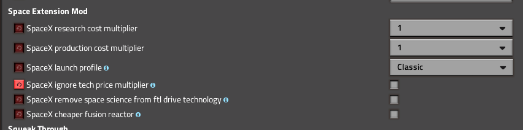
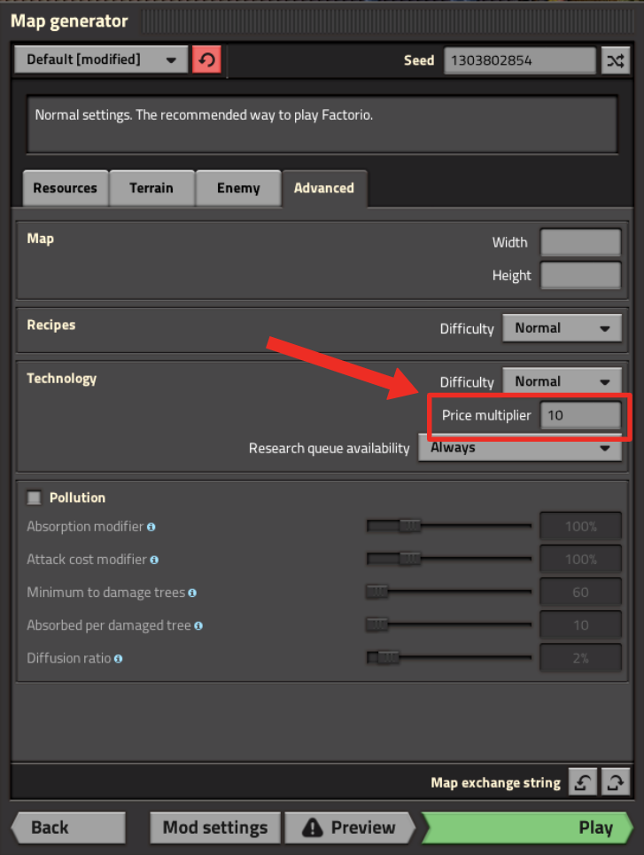
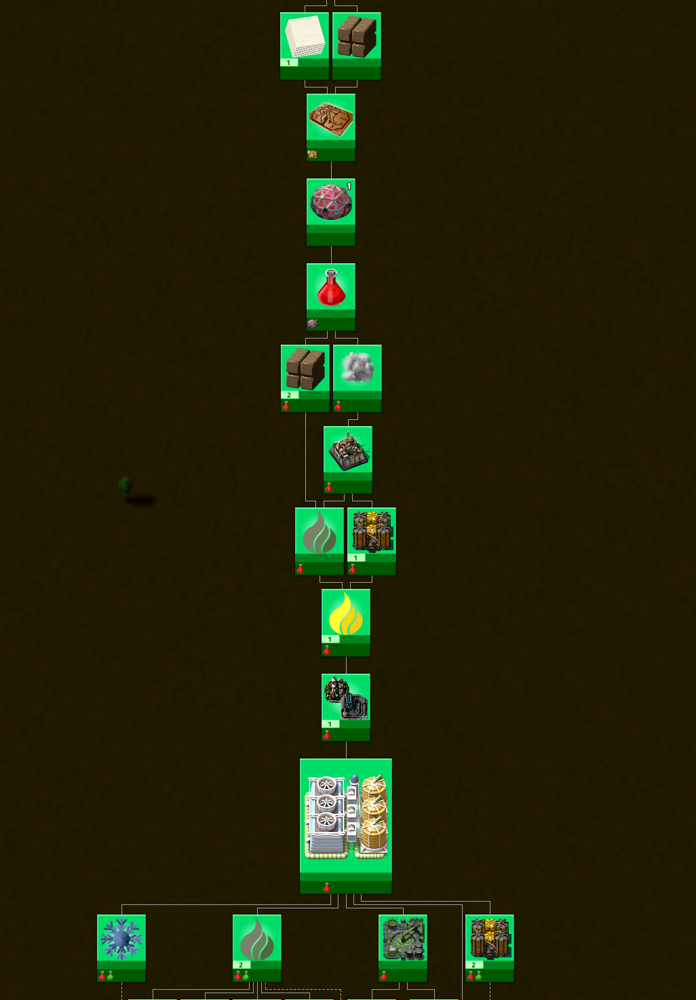
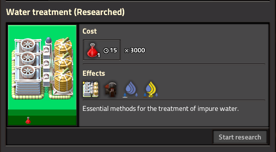
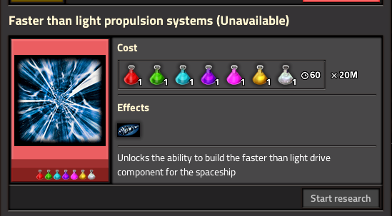

# Guides: Multiplier

## Why use a tech research multiplier?

Some Seablock players choose to increase the tech research cost multiplier to make the game last longer. With so many items and recipes, you can unlock technologies faster than you can use them at the default 1x setting. Raising the multiplier to 5x, 10x, or even 100x slows down progress and lets you enjoy the mod for more time. Many players find 10x to be a good middle ground, while some prefer the challenge of 100x.

Seablock is a complex overhaul mod. If you’re new to this type of mod, it’s best to stick with the default 1x multiplier for the intended experience. If you’re comfortable with Seablock or overhaul mods, trying a higher multiplier can be a rewarding challenge.

## How to set the multiplier

### FTL techs

To apply the multiplier to FTL technologies, open the "Settings / Mod settings" screen at startup and make sure to uncheck "SpaceX ignore tech price multiplier".

<div style="text-align: center; max-width: 852px; margin: 1em auto;">
  
  <div style="font-style: italic; font-size: 0.95em; margin-top: 0.5em;">
    Unchecking this box lets the multiplier affect FTL techs
  </div>
</div>

### New games

When starting a new game, go to the "Advanced" tab and enter your desired value in the "Price multiplier" field.

<div style="text-align: center; max-width: 449px; margin: 1em auto;">
  
</div>

### Existing saves

To change the multiplier in an existing save, use this command in the console:

```
/c game.difficulty_settings.technology_price_multiplier = 10
```

Change the number to set your preferred multiplier.

### Multiplayer games

For multiplayer, edit the `technology_price_multiplier` key in `./data/map-settings.example.json`, save as a new file (e.g., `my-map-settings.json`), and create a save with:

```
./bin/x64/factorio --create saves/my-save.zip --map-gen-settings my-map-gen-settings.json --map-settings my-map-settings.json
```

## How does the multiplier affect research?

The multiplier starts applying to technologies after "Water Treatment".

<div style="text-align: center; max-width: 543px; margin: 1em auto;">
  
  <div style="font-style: italic; font-size: 0.95em; margin-top: 0.5em;">
    Techs up to Water Treatment use the default 1x multiplier
  </div>
</div>

<div style="text-align: center; max-width: 549px; margin: 1em auto;">
  
  <div style="font-style: italic; font-size: 0.95em; margin-top: 0.5em;">
    Example: tech cost with 100x multiplier
  </div>
</div>

For example, if a tech normally costs 30, setting the multiplier to 10x will make it cost 300.

<div style="text-align: center; max-width: 549px; margin: 1em auto;">
  
  <div style="font-style: italic; font-size: 0.95em; margin-top: 0.5em;">
    The final tech costs 20 million with a 100x multiplier
  </div>
</div>

## Tips for playing with a high multiplier

The best advice is to [join the Seablock Discord](https://discord.gg/zkg8rdn) for help and discussion about high-multiplier games. The community is friendly and knowledgeable. The [/r/Seablock subreddit](https://www.reddit.com/r/Seablock/) is also a great resource.

If you want to try a multiplier run, you should already be comfortable with core mechanics like trains and fluids. This isn’t the time to learn LTN setups! Using planners such as [YAFC](https://github.com/ShadowTheAge/yafc), [Foreman](https://github.com/DanielKote/Foreman2), [Helmod](https://mods.factorio.com/mod/helmod), and [Factory Planner](https://mods.factorio.com/mod/factoryplanner) is highly recommended.

Recommended mods for building a megabase in high-multiplier games:

- [Seablock megabase fix](https://mods.factorio.com/mod/duff-seablock-megabase): Fixes over-production bugs from productivity modules and production caps.
- [Solar sails](https://mods.factorio.com/mod/solar-sails): Adds a costly item that generates 200MW, helping reduce UPS load in late-game builds.
